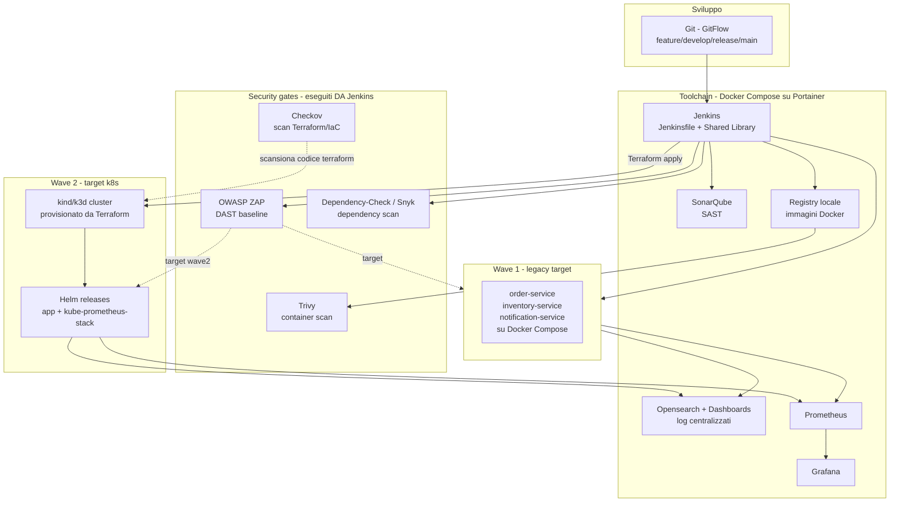

# Progetto portfolio: "Release Toolchain Renewal Sandbox"
 
## Il concept
 
Non costruiamo solo "una pipeline CI/CD con un po' di tool dentro". Costruiamo una **simulazione in scala dell'engagement Capgemini stesso**: assessment → design → wave 1 (legacy) → wave 2 (target) → dismissione del sistema precedente.
 
Questo è il tuo argomento più forte in colloquio: non stai dicendo "conosco Jenkins e Terraform", stai dicendo *"ho già attraversato in piccolo lo stesso percorso che farò con voi, e capisco perché si fanno due wave invece di un big-bang"*.
 
| Fase JD | Fase progetto |
|---|---|
| Assessment | Sprint 1 — mappatura toolchain attuale (Docker Compose / Portainer) |
| Design soluzione | Sprint 2 — pipeline DevSecOps + IaC del target (mini-k8s) |
| Wave 1 rollout | Sprint 3, gg 11-12 — 3 microservizi live su Compose/Portainer |
| Wave 2 rollout | Sprint 3, gg 13-14 — stessi microservizi migrati su k8s via pipeline |
| Dismissione legacy | Sprint 3, g 15 — teardown Wave 1 via Ansible/Terraform |
 
---
 
## Architettura
 

 
---
 
## Stack recap card
 
| Categoria JD | Tool scelto | Ruolo nel progetto | Note costo |
|---|---|---|---|
| CI/CD | Jenkins (LTS, JCasC) | Orchestratore centrale, Jenkinsfile dichiarativo + Shared Library Groovy | Free, self-host |
| Git/branching | Git + GitFlow | feature → develop → release → main, branch protetti simulati | Free |
| IaC | Terraform | Provisioning cluster kind/k3d, Helm releases, eventuali container Docker del toolchain | Free, provider locali |
| Config mgmt | Ansible | Setup agent Jenkins, templating config app per ambiente, smoke test, playbook di decommissioning | Free |
| Container | Docker + Docker Compose | Wave 1 (legacy), tutti i tool del toolchain | Free |
| Orchestrazione | Kubernetes (kind o k3d) | Wave 2 (target), gestito via Portainer + Helm | Free, locale |
| Mgmt UI | Portainer CE | Cruscotto unico su Compose *e* sull'ambiente k8s registrato | Free, CE |
| SAST | SonarQube Community | Quality gate nella pipeline, blocca su soglie | Free, self-host |
| Dependency scan | OWASP Dependency-Check (+ Snyk CLI free tier opzionale) | Stage dedicato, fail su CVE critiche | Free / free tier |
| Container scan | Trivy | Scan immagine prima del push a registry locale | Free |
| DAST | OWASP ZAP (baseline scan) | Contro endpoint staging, sia Wave1 che Wave2 | Free |
| IaC security | Checkov | Scan dei moduli Terraform prima dell'apply | Free |
| Observability | Prometheus + Grafana | Metriche Jenkins, container, app (Actuator/Micrometer/FastAPI exporter) | Free |
| Log centralizzati | Opensearch + Opensearch Dashboards + Filebeat/Fluent-bit | Log Jenkins + app, sia Wave1 che Wave2 | Free |
 
**App target (3 microservizi, riflettono il tuo stack reale — credibile da raccontare):**
- `order-service` — Java 21 / Spring Boot
- `inventory-service` — Quarkus
- `notification-service` — Python / FastAPI
---
 
## Timeline — 3 settimane, 16 giorni lavorativi
 
### Sprint 1 — Assessment & Fondamenta (gg 1-6)
*Obiettivo: il toolchain "as-is" è in piedi, primo microservizio passa nella pipeline base.*

| Giorno | Task | Deliverable | Punto JD | Perché in questo ordine |
| --- | --- | --- | --- | --- |
| **1** | Repo skeleton (3 microservizi, GitFlow documentato), Docker Compose con Jenkins (JCasC) + Portainer | `docker-compose.yml` toolchain v0, repo Git inizializzati via SSH | CI/CD & Automation / Git GitFlow | Senza il "campo di gioco" non puoi scrivere nessuna pipeline. Parti dall'infrastruttura minima, non dal codice applicativo. |
| **2** | `order-service` minimale (CRUD + Actuator/Micrometer), Dockerfile multi-stage | Immagine Docker buildabile localmente | Container & Cloud / Docker | Devi avere *qualcosa* da pipelinare prima di scrivere il Jenkinsfile — l'app è lo strumento, non il prodotto. |
| **3** | Scaffolding Jenkins Shared Library (`vars/`, `src/`), allineamento Plugin Core (Git/Pipeline) e Upgrade Core Jenkins | Struttura libreria Groovy pronta e Jenkins Core (v2.555.3) aggiornato | Jenkins Infrastructure, Groovy | Prima di scrivere le pipeline dei microservizi, centralizzi le logiche ripetitive (`buildJavaApp`, `dockerBuildPush`) per evitare il "copia-incolla" del codice. |
| **4** | Primo `Jenkinsfile` dichiarativo su `order-service` integrato con la Shared Library via SCM | Prima pipeline verde (Checkout → Maven Build → Docker Build locale) | Jenkins Pipeline Dichiarative | Unisci l'applicazione (Giorno 2) alla Shared Library (Giorno 3) orchestrando il primo ciclo reale di build automatizzata. |
| **5** | SonarQube in Compose + stage SAST nel Jenkinsfile con quality gate bloccante | Pipeline che fallisce se il gate Sonar non passa | DevSecOps shift-left, SonarQube | *Shift-left* reale: il primo gate di sicurezza e qualità del codice si posiziona subito dopo la build iniziale, bloccando i rilasci fallimentari sul nascere. |
| **6** | Registry Docker locale + push immagine, Opensearch+Dashboards in Compose, primo shipping log Jenkins via Filebeat | Log Jenkins visibili su Opensearch Dashboards | ELK/Opensearch | Chiudi lo Sprint con l'osservabilità minima: ti servirà per il debug avanzato nei prossimi sprint quando le pipeline cresceranno. |

### Sprint 2 — Design della soluzione & DevSecOps (gg 7-11)
*Obiettivo: pipeline DevSecOps completa su tutti i microservizi, IaC del target k8s pronto (non ancora applicato in produzione del progetto).*
 
| Giorno | Task | Deliverable | Punto JD | Perché |
|--------|---|---|---|---|
| 7      | `inventory-service` (Quarkus) e `notification-service` (FastAPI) scaffolding, Shared Library estesa con stage parametrici per linguaggio diverso | 3 Jenkinsfile che riusano la stessa libreria | CI/CD end-to-end, Groovy | Qui dimostri il valore reale delle Shared Library: stage di build diversi (Maven/Quarkus/pip) dietro un'interfaccia comune |
| 8      | Stage Dependency scan (OWASP Dependency-Check o Snyk CLI) su tutti e 3 i servizi | Report dipendenze, fail su CVE critiche | Dependency Scan, vulnerability management | Lo metti dopo il build perché serve l'artefatto/lockfile risolto, non il codice sorgente nudo |
| 9      | Stage Trivy su immagine Docker dopo push a registry | Fail pipeline su CVE HIGH/CRITICAL nell'immagine | Container Scan | Container scan logicamente viene *dopo* il build dell'immagine — è l'ultimo controllo prima che l'artefatto sia "deployabile" |
| 10     | Moduli Terraform: provider `kind` (o script local-exec se provider non disponibile) per il cluster, modulo Helm per `kube-prometheus-stack`. Stage Checkov nella pipeline su questi moduli | `terraform plan` pulito + Checkov senza findings bloccanti | Terraform (moduli, state), Checkov | L'IaC del target la scrivi ora, ma *non la applichi ancora* — stai nella fase "design", esattamente come nella JD: design prima del rollout |
| 11     | Ruoli Ansible: `jenkins-agent-setup` (tool CLI su agent), `app-config` (template env-specific con Jinja2), playbook di smoke-test post-deploy | 3 playbook testati su un agent Docker | Ansible (playbook, roles) | Ansible qui ha un ruolo diverso da Terraform e devi saperlo argomentare: non provisiona infrastruttura, configura ciò che gira sopra |
 
### Sprint 3 — Wave 1, Wave 2 & dismissione (gg 12-16)
*Obiettivo: rollout reale a due wave, observability end-to-end, decommissioning documentato.*
 
| Giorno | Task | Deliverable | Punto JD | Perché |
|--------|---|---|---|---|
| 12     | Stage di deploy verso Wave 1 (Docker Compose via Portainer API o stack file), DAST con OWASP ZAP baseline contro gli endpoint Wave 1 | 3 microservizi live su Compose, report ZAP | Workflow di deployment, DevSecOps | Wave 1 = ambiente "legacy-like": qui il deploy è il più semplice possibile, di proposito, perché rappresenta il sistema da sostituire |
| 13     | Dashboard Grafana (metriche Wave1: latency, error rate, container resource) + alert basilari Prometheus | Dashboard funzionante, 1-2 alert rule | Monitorare pipeline e ambienti | Prima di passare a Wave 2 ti serve una baseline misurabile — altrimenti non puoi dire "abbiamo migliorato" |
| 14     | `terraform apply` reale del cluster kind/k3d, registrazione del cluster su Portainer come secondo "environment" | Cluster k8s visibile in Portainer accanto allo stack Compose | Kubernetes, cruscotto unificato | Qui materializzi il design dello Sprint 2 — e risolvi concretamente il problema "JD": un solo pannello per due tecnologie diverse |
| 15     | Pipeline estesa con stage `deploy-to-k8s` (Helm upgrade/install) per i 3 microservizi, playbook Ansible di validazione post-deploy su k8s, ZAP/Trivy ripetuti contro Wave 2 | Wave 2 live, stessi security gate applicati | Pipeline end-to-end, automazione completa | Wave 2 riusa *gli stessi* stage di sicurezza di Wave 1 tramite Shared Library — dimostri che il design DevSecOps è portabile tra target diversi |
| 16     | Playbook Ansible + `terraform destroy` per dismettere Wave 1, documentazione tecnica finale (architettura, runbook, decisioni e trade-off), README portfolio con talking points per il colloquio | Repo finale + doc + diagramma architetturale | Definire standard, best practice, documentazione | Chiudi esattamente come chiuderebbe il progetto reale: smantellamento controllato + documentazione che un collega potrebbe seguire senza di te |
 
---
 
## Note pratiche
 
- **Repo structure suggerita**: monorepo con `/services/order-service`, `/services/inventory-service`, `/services/notification-service`, `/infra/terraform`, `/infra/ansible`, `/jenkins/shared-library`, `/toolchain/docker-compose.yml`.
- **Snyk**: il tier free ha limiti di scan mensili — se vuoi nominarlo in CV usalo per 2-3 run dimostrativi, ma tieni OWASP Dependency-Check come motore principale per non bloccarti a metà sprint.
- **kind vs k3d**: kind è più "standard" e documentato per demo, k3d è più leggero su risorse se la macchina è limitata — scegli in base a quanta RAM hai libera, non cambia nulla a livello di racconto in colloquio.
- **Portainer + provider Terraform**: verifica la disponibilità/maturità di un provider Terraform per Portainer al momento in cui arrivi al giorno 9 — se non è soddisfacente, va benissimo gestire Portainer fuori da Terraform e documentare la scelta come decisione consapevole (è materiale di colloquio anche questo: "ho valutato X, ma ho scelto Y perché...").
Quando vuoi iniziare a scrivere il primo file (es. `docker-compose.yml` toolchain del Giorno 1, o il primo `Jenkinsfile`), lo affrontiamo file per file come al solito.
